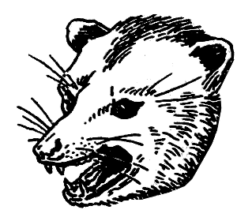

Documentation
=============

opmuse is a web application to play, organize, share and make your music library social.

These pages document development of opmuse. If you want to use opmuse you
should go to the `opmuse website`_. If you actually want to develop you can
start by reading :doc:`contributing`. Then you can take a look at
:doc:`gettingstarted` for instructions on how to setup an environment etc.

Other Resources
===============

 - `opmuse website`_.
 - `GitHub repository`_.
 - `GitHub issue tracker`_.
 - `#opmuse at OFTC`_.
 - `opmuse on Twitter`_.
 - `opmuse on Open Hub`_.

.. _`GitHub issue tracker`: https://github.com/opmuse/opmuse/issues
.. _`GitHub repository`: https://github.com/opmuse/opmuse
.. _`#opmuse at OFTC`: https://webchat.oftc.net/?randomnick=1&channels=opmuse&prompt=1&uio=MT11bmRlZmluZWQb1
.. _`opmuse on Twitter`: https://twitter.com/opmuse
.. _`opmuse website`: http://opmu.se/
.. _`opmuse on Open Hub`: https://www.openhub.net/p/opmuse

Index
=====

.. toctree::
   :maxdepth: 2

   contributing
   gettingstarted
   testing
   reference

Indices and tables
==================

 - :ref:`genindex`
 - :ref:`modindex`
 - :ref:`search`

